# Ammalgam Protection System

A reactive smart contract system built on the Lasna Network that provides automated position protection for users in Ammalgam liquidity pairs on Sepolia. The system monitors user positions in real-time and automatically executes protection measures when health factors fall below configured thresholds using Ammalgam's precise risk calculations.

## Enhanced System Architecture

**Lasna Testnet (RSC)**: Listens to Sepolia Ammalgam events, processes data, sends callbacks to Sepolia
**Sepolia Testnet**: Ammalgam protocol + Callback contract execute protection strategies

## System Flow

```mermaid
sequenceDiagram
    participant User
    participant ReactiveContract as Reactive Contract<br/>(Lasna Network)
    participant CallbackContract as Callback Contract<br/>(Sepolia)
    participant AmmalgamPair as Ammalgam Pair<br/>(Sepolia)
    participant ProtectionToken as Protection Token<br/>(Sepolia)
    participant SystemContract as System Contract<br/>(Lasna)

    Note over User, SystemContract: Phase 1: Cross-Chain System Setup
    
    User->>CallbackContract: Deploy AmmalgamProtectionCallback on Sepolia
    User->>ReactiveContract: Deploy AmmalgamProtectionReactive on Lasna
    User->>ReactiveContract: addMonitoredPair(sepoliaAmmalgamPairAddress)
    ReactiveContract->>SystemContract: Subscribe to Sepolia Ammalgam events

    Note over User, SystemContract: Phase 2: User Subscription (Sepolia)
    
    User->>ProtectionToken: approve(callbackContract, maxAmount)
    User->>CallbackContract: subscribeToProtection(pair, type, threshold, target, asset, maxAmount)
    CallbackContract->>AmmalgamPair: getInputParams(user) - Verify position exists
    AmmalgamPair-->>CallbackContract: Return InputParams + borrowing confirmation
    CallbackContract->>CallbackContract: Store positionCreationTime for aging analysis
    CallbackContract-->>User: emit UserSubscribed

    Note over User, SystemContract: Phase 3: Enhanced Periodic Monitoring (Every 5 Minutes)
    
    SystemContract->>ReactiveContract: CRON Event (Lasna)
    ReactiveContract->>ReactiveContract: _handlePeriodicCheck()
    ReactiveContract->>CallbackContract: checkAndProtectPositions(address(0))
    Note over ReactiveContract, CallbackContract: Cross-chain: Lasna → Sepolia
    
    loop For Each Subscribed User
        CallbackContract->>AmmalgamPair: getInputParams(user, true)
        AmmalgamPair-->>CallbackContract: Enhanced InputParams with price ranges
        
        CallbackContract->>CallbackContract: _analyzePositionEnhanced()
        Note over CallbackContract: Enhanced Analysis:<br/>• Precise Ammalgam LTV<br/>• Direct Solvency Check<br/>• Hard/Soft Liquidation Premiums<br/>• Risk Type (Hard/Soft/Leverage)<br/>• Position Age from Creation
        
        CallbackContract->>CallbackContract: _determineIfProtectionNeeded()
        Note over CallbackContract: Multi-Factor Decision:<br/>• wouldFailSolvency<br/>• ammalgamLTV ≥ 60%<br/>• healthFactor < threshold<br/>• hardLiquidationPremium > 0<br/>• softLiquidationPremium > 5%
        
        alt Protection Needed (Multi-Factor Risk)
            CallbackContract->>CallbackContract: _executeProtection()
            
            alt Protection Type: COLLATERAL_ONLY
                CallbackContract->>ProtectionToken: transferFrom(user, contract, calculatedAmount)
                CallbackContract->>ProtectionToken: transfer(pair, amount)
                CallbackContract->>AmmalgamPair: deposit(user)
                
            else Protection Type: DEBT_REPAYMENT_ONLY
                CallbackContract->>ProtectionToken: transferFrom(user, contract, calculatedAmount)
                CallbackContract->>ProtectionToken: transfer(pair, amount)
                
                alt Leverage Risk + Liquidity Debt
                    CallbackContract->>AmmalgamPair: repayLiquidity(user)
                    Note over CallbackContract: Deleveraging strategy
                else Soft Risk + Liquidity Debt
                    CallbackContract->>AmmalgamPair: repayLiquidity(user)
                    Note over CallbackContract: Saturation reduction
                else Hard Risk or No Liquidity Debt
                    CallbackContract->>AmmalgamPair: repay(user)
                    Note over CallbackContract: Standard debt repayment
                end
            end
            
            CallbackContract-->>ReactiveContract: emit ProtectionExecuted(riskType, ammalgamLTV)
            
        else Position Safe (Multi-Factor Check)
            Note over CallbackContract: Skip - all risk factors OK
        end
    end
    
    CallbackContract-->>ReactiveContract: emit ProtectionCycleCompleted
    ReactiveContract->>ReactiveContract: processingActive = false

    Note over User, SystemContract: Phase 4: Emergency Response (Sepolia→Lasna→Sepolia)

    AmmalgamPair-->>ReactiveContract: Liquidation Event (Cross-chain detection)
    Note over ReactiveContract: Lasna RSC detects Sepolia liquidation
    ReactiveContract->>ReactiveContract: _handleLiquidationEvent()
    ReactiveContract->>ReactiveContract: Extract borrower from topic_1
    ReactiveContract->>CallbackContract: emergencyProtectionCheck(address(0), borrower, pair)
    Note over ReactiveContract, CallbackContract: Cross-chain: Lasna → Sepolia
    
    CallbackContract->>CallbackContract: Check if borrower is subscribed
    
    alt Borrower IS Subscribed to Protection
        CallbackContract->>CallbackContract: _checkAndProtectUser(borrower, emergency=true)
        CallbackContract->>AmmalgamPair: getInputParams(borrower)
        CallbackContract->>CallbackContract: _analyzePositionEnhanced() - Full Ammalgam analysis
        
        alt Position Still At Risk (Enhanced Detection)
            CallbackContract->>CallbackContract: Execute immediate protection (1-min cooldown)
            Note over CallbackContract: Risk-adjusted protection amounts<br/>Emergency multipliers applied
            CallbackContract-->>ReactiveContract: emit ProtectionExecuted
        else Position Now Safe (Ammalgam Calculations)
            Note over CallbackContract: No additional protection needed
        end
        
    else Borrower NOT Subscribed
        Note over CallbackContract: Skip - user not in protection system<br/>Gas-efficient filtering
    end
    
    CallbackContract-->>ReactiveContract: emit ProtectionCycleCompleted

    Note over User, SystemContract: Phase 5: Real-time Position Change Response (Sepolia→Lasna→Sepolia)

    User->>AmmalgamPair: borrow() / withdraw() [Risk Increasing]
    AmmalgamPair-->>ReactiveContract: Borrow/Withdraw Event (Cross-chain detection)
    Note over ReactiveContract: Lasna RSC detects Sepolia position change
    ReactiveContract->>ReactiveContract: _handleRiskIncreasingEvent()
    ReactiveContract->>ReactiveContract: Extract user from topic_1
    ReactiveContract->>CallbackContract: positionChangeProtectionCheck(address(0), user, pair)
    Note over ReactiveContract, CallbackContract: Cross-chain: Lasna → Sepolia
    
    CallbackContract->>CallbackContract: Check if user is subscribed
    
    alt User IS Subscribed to Protection
        CallbackContract->>CallbackContract: _checkAndProtectUser(user)
        CallbackContract->>AmmalgamPair: getInputParams(user, true)
        CallbackContract->>CallbackContract: _analyzePositionEnhanced()
        Note over CallbackContract: Enhanced Risk Analysis:<br/>• Ammalgam LTV calculation<br/>• Direct solvency validation<br/>• Liquidation premium assessment
        
        alt Position Now At Risk (Enhanced Detection)
            CallbackContract->>CallbackContract: Execute protection with risk-adjusted amounts
            CallbackContract-->>ReactiveContract: emit ProtectionExecuted
        else Position Still Safe (Multi-Factor Check)
            Note over CallbackContract: No protection needed
        end
        
    else User NOT Subscribed
        Note over CallbackContract: Skip - user not protected<br/>Efficient subscription filtering
    end

    User->>AmmalgamPair: repay() / deposit() [Risk Decreasing]
    AmmalgamPair-->>ReactiveContract: Repay/Deposit Event (Lower Priority)
    ReactiveContract->>ReactiveContract: _handleRiskDecreasingEvent() - Longer cooldown
    ReactiveContract->>CallbackContract: positionChangeProtectionCheck(address(0), user, pair)
    
    Note over CallbackContract: Same enhanced subscription check logic<br/>Lower priority processing (60s cooldown)

    Note over User, SystemContract: Phase 6: Enhanced User Management & Analytics

    User->>CallbackContract: analyzeUserPosition(user, pair)
    CallbackContract->>AmmalgamPair: getInputParams(user, true)
    CallbackContract->>CallbackContract: Full enhanced risk analysis
    CallbackContract-->>User: Return detailed metrics:<br/>• healthFactor<br/>• ammalgamLTV<br/>• riskType<br/>• wouldFailSolvency<br/>• liquidationPremiums
    
    User->>CallbackContract: isPositionAtRisk(user, pair)
    CallbackContract-->>User: Detailed risk assessment with reasons
    
    User->>CallbackContract: getSystemStats()
    CallbackContract-->>User: System-wide protection statistics
    
    User->>CallbackContract: unsubscribeFromProtection(pair)
    CallbackContract->>CallbackContract: Remove protection & cleanup
    CallbackContract-->>User: emit UserUnsubscribed

    Note over User, SystemContract: Enhanced Protection Execution Details

    Note over CallbackContract: Risk-Adjusted Protection Amounts:<br/>• Base: Health factor deficit<br/>• LTV Excess: (ammalgamLTV - 60%) factor<br/>• Risk Multipliers: Leverage +50%, Soft +25%<br/>• Emergency: 2x-2.5x for critical situations

    Note over CallbackContract: Smart Repayment Strategy:<br/>• Leverage + Liquidity Debt → repayLiquidity()<br/>• Soft + Liquidity Debt → repayLiquidity()<br/>• Hard or No Liquidity Debt → repay()

    Note over CallbackContract: Multi-Layer Risk Detection:<br/>• Traditional health factor<br/>• Ammalgam LTV thresholds<br/>• Direct solvency validation<br/>• Liquidation premium assessment<br/>• Time-based saturation risk
```

## Enhanced Protection Triggers

### Hard Liquidation Detection
- **Ammalgam LTV** ≥ 60% (START_NEGATIVE_PREMIUM_LTV_BIPS)
- **Health Factor** < user threshold
- **Direct Solvency** failure using Ammalgam validation
- **Hard Liquidation Premium** > 0

### Soft Liquidation Detection  
- **Position Age** > 7 days
- **Leverage Ratio** > 3x
- **Borrow Utilization** > 80%
- **Soft Liquidation Premium** > 5%

### Leverage Liquidation Detection
- **Leverage Ratio** ≥ 5x OR **Ammalgam LTV** ≥ 75%
- **Immediate Action** required flag
- **Over-leveraged** position relative to collateral

## Cross-Chain Event Flow

1. **Sepolia Ammalgam Event** → **Lasna RSC Detection** → **Process & Extract Data** → **Sepolia Callback Execution**
2. **Smart Subscription Filtering**: Only processes subscribed users (gas efficient)
3. **Priority-Based Response**: Liquidation (immediate) > Borrow/Withdraw (30s) > Repay/Deposit (60s)
4. **Enhanced Risk Analysis**: Uses Ammalgam's actual LTV calculations and solvency validation
