# Ammalgam Protection System

A reactive smart contract system built on the Kopli Network that provides automated position protection for users in Ammalgam liquidity pairs. The system monitors user positions in real-time and automatically executes protection measures when health factors fall below configured thresholds.

## System Flow

```mermaid
sequenceDiagram
    participant User
    participant ReactiveContract as Reactive Contract<br/>(Kopli Network)
    participant CallbackContract as Callback Contract<br/>(Destination Chain)
    participant AmmalgamPair as Ammalgam Pair
    participant ProtectionToken as Protection Token
    participant SystemContract as System Contract<br/>(Kopli)

    Note over User, SystemContract: Phase 1: System Setup
    
    User->>CallbackContract: Deploy AmmalgamProtectionCallback
    User->>ReactiveContract: Deploy AmmalgamProtectionReactive
    User->>ReactiveContract: addMonitoredPair(pairAddress)
    ReactiveContract->>SystemContract: Subscribe to all relevant events

    Note over User, SystemContract: Phase 2: User Subscription
    
    User->>ProtectionToken: approve(callbackContract, maxAmount)
    User->>CallbackContract: subscribeToProtection(pair, type, threshold, target, asset, maxAmount)
    CallbackContract->>AmmalgamPair: getInputParams(user) - Verify position exists
    AmmalgamPair-->>CallbackContract: Confirm borrowing position
    CallbackContract-->>User: emit UserSubscribed

    Note over User, SystemContract: Phase 3: Periodic Monitoring (Every 5 Minutes)
    
    SystemContract->>ReactiveContract: CRON Event
    ReactiveContract->>ReactiveContract: _handlePeriodicCheck()
    ReactiveContract->>CallbackContract: checkAndProtectPositions()
    
    loop For Each Subscribed User
        CallbackContract->>AmmalgamPair: getInputParams(user, true)
        AmmalgamPair-->>CallbackContract: Current position data
        
        CallbackContract->>CallbackContract: _analyzePosition()
        Note over CallbackContract: Calculate:<br/>• Health Factor<br/>• Risk Type (Hard/Soft/Leverage)<br/>• Protection Need
        
        alt Health Factor Below Threshold
            CallbackContract->>CallbackContract: _executeProtection()
            
            alt Protection Type: COLLATERAL_ONLY
                CallbackContract->>ProtectionToken: transferFrom(user, contract, amount)
                CallbackContract->>ProtectionToken: transfer(pair, amount)
                CallbackContract->>AmmalgamPair: deposit(user)
                
            else Protection Type: DEBT_REPAYMENT_ONLY
                CallbackContract->>ProtectionToken: transferFrom(user, contract, amount)
                CallbackContract->>ProtectionToken: transfer(pair, amount)
                
                alt Leverage Risk + Liquidity Debt
                    CallbackContract->>AmmalgamPair: repayLiquidity(user)
                else Standard Debt
                    CallbackContract->>AmmalgamPair: repay(user)
                end
            end
            
            CallbackContract-->>ReactiveContract: emit ProtectionExecuted
            
        else Health Factor OK
            Note over CallbackContract: Skip - position safe
        end
    end
    
    CallbackContract-->>ReactiveContract: emit ProtectionCycleCompleted
    ReactiveContract->>ReactiveContract: processingActive = false

    Note over User, SystemContract: Phase 4: Emergency Response (Liquidation Event)

    AmmalgamPair-->>ReactiveContract: Liquidation Event
    ReactiveContract->>ReactiveContract: _handleLiquidationEvent()
    ReactiveContract->>ReactiveContract: Extract borrower from event
    ReactiveContract->>CallbackContract: emergencyProtectionCheck(borrower, pair)
    
    CallbackContract->>CallbackContract: Check if borrower is subscribed
    
    alt Borrower IS Subscribed
        CallbackContract->>CallbackContract: _checkAndProtectUser(borrower, emergency=true)
        CallbackContract->>AmmalgamPair: getInputParams(borrower)
        
        alt Position Still At Risk
            CallbackContract->>CallbackContract: Execute immediate protection (1-min cooldown)
            CallbackContract-->>ReactiveContract: emit ProtectionExecuted
        else Position Now Safe
            Note over CallbackContract: No additional protection needed
        end
        
    else Borrower NOT Subscribed
        Note over CallbackContract: Skip - user not protected by our system
    end
    
    CallbackContract-->>ReactiveContract: emit ProtectionCycleCompleted

    Note over User, SystemContract: Phase 5: Position Change Response (Real-time)

    User->>AmmalgamPair: borrow() / withdraw() [Risk Increasing]
    AmmalgamPair-->>ReactiveContract: Borrow/Withdraw Event
    ReactiveContract->>ReactiveContract: _handleRiskIncreasingEvent()
    ReactiveContract->>ReactiveContract: Extract user from event
    ReactiveContract->>CallbackContract: positionChangeProtectionCheck(user, pair)
    
    CallbackContract->>CallbackContract: Check if user is subscribed
    
    alt User IS Subscribed
        CallbackContract->>CallbackContract: _checkAndProtectUser(user)
        
        alt Position Now At Risk
            CallbackContract->>CallbackContract: Execute protection
            CallbackContract-->>ReactiveContract: emit ProtectionExecuted
        else Position Still Safe
            Note over CallbackContract: No protection needed
        end
        
    else User NOT Subscribed
        Note over CallbackContract: Skip - user not protected
    end

    User->>AmmalgamPair: repay() / deposit() [Risk Decreasing]
    AmmalgamPair-->>ReactiveContract: Repay/Deposit Event (Lower Priority)
    ReactiveContract->>ReactiveContract: _handleRiskDecreasingEvent() - Longer cooldown
    ReactiveContract->>CallbackContract: positionChangeProtectionCheck(user, pair)
    
    Note over CallbackContract: Same subscription check logic<br/>Lower priority processing

    Note over User, SystemContract: Phase 6: User Management

    User->>CallbackContract: getUserProtection(user, pair)
    CallbackContract-->>User: Return protection status
    
    User->>CallbackContract: unsubscribeFromProtection(pair)
    CallbackContract->>CallbackContract: Remove protection & cleanup
    CallbackContract-->>User: emit UserUnsubscribed
```

